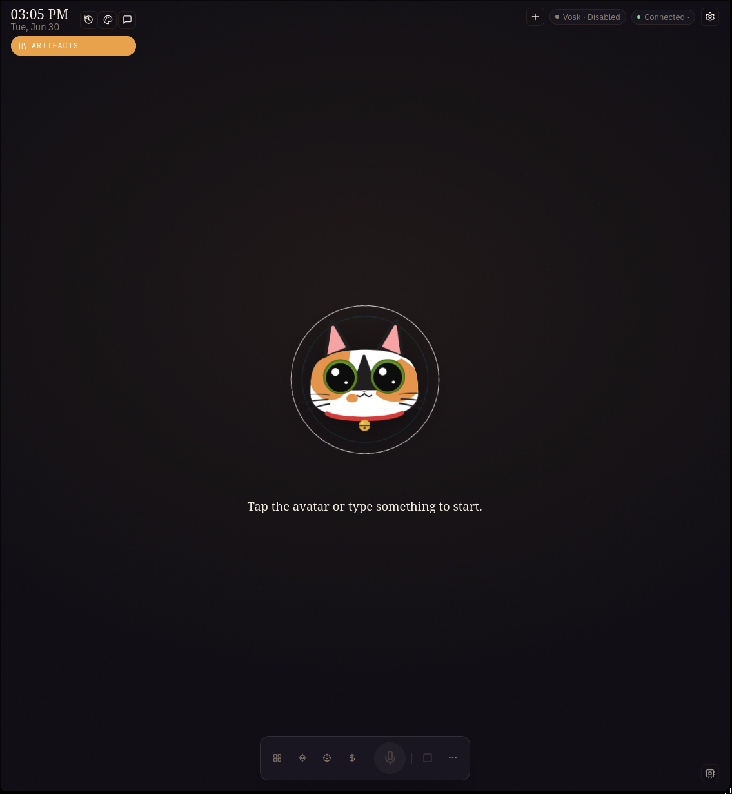
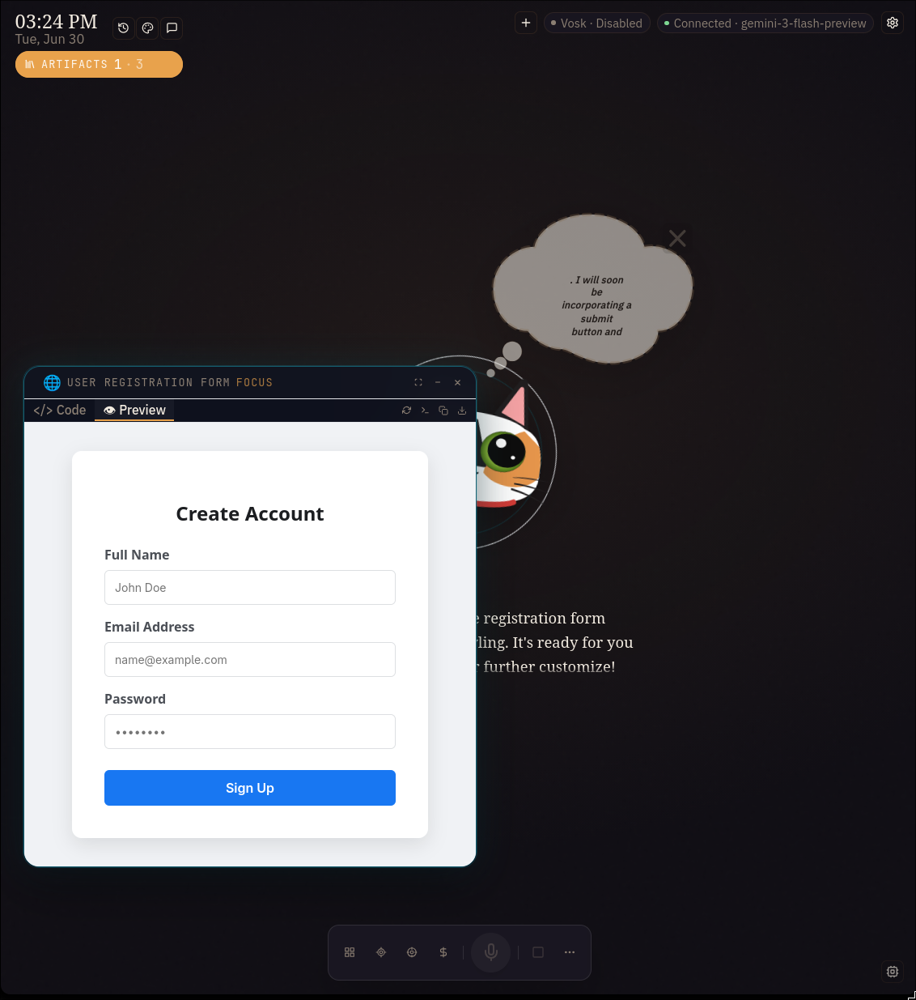
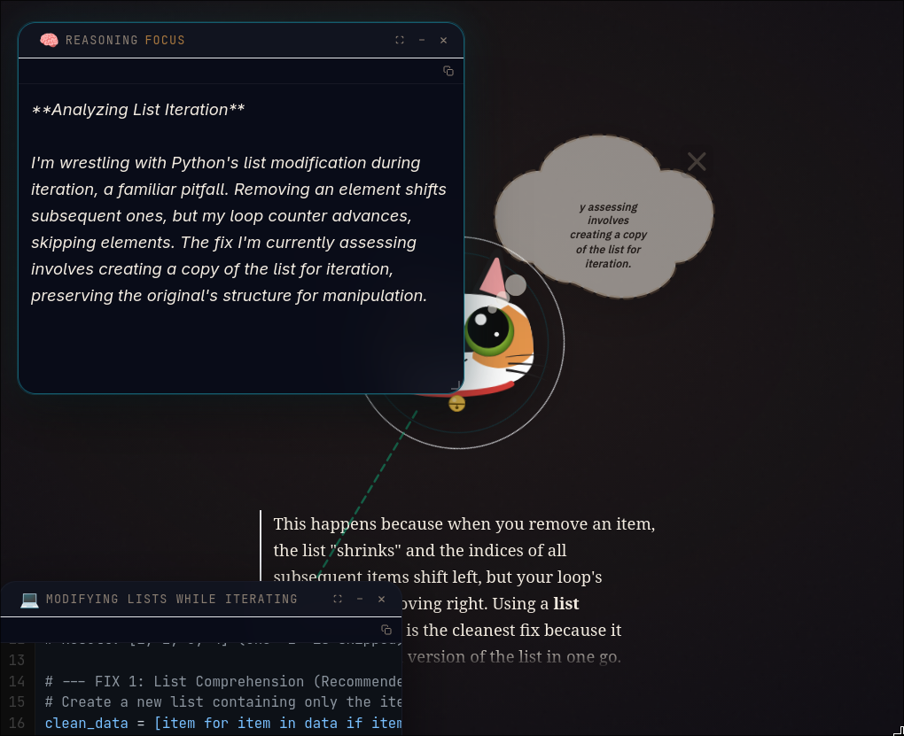
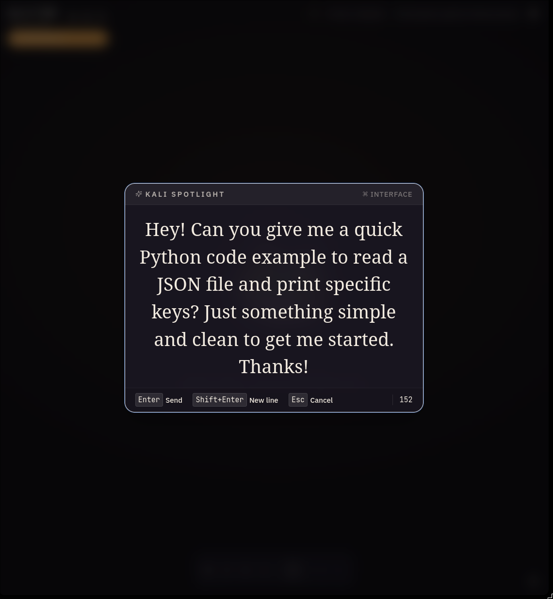

# Kali — AI Companion

[](https://github.com/fr4j4/kali-companion)

A cat-themed, always-on desktop companion that lives on your second
monitor. Not a chatbot — a presence that researches, renders, and acts on
your behalf. Voice and text are first-class equals. Local-first by default.



## What Kali does

- Sits fullscreen on a second monitor (or a dedicated device), always
  present while you code, game, or work.
- Listens and speaks with parity: talk to it while your hands are busy, or
  type when you need precision.
- Goes beyond conversation: runs tests, creates git worktrees in parallel,
  launches apps, organizes folders, researches the web, renders mockups and
  documents, and looks at your screen — only when you allow it.
- Works with or without [nanobot](https://github.com/fr4j4/nanobot): a
  self-contained agent runtime is included, and nanobot is an optional LLM
  provider for those who already run it.
- Local-first: offline speech recognition (Vosk), local TTS (Piper + numpy
  effects, no ffmpeg required). The LLM is configurable (local or cloud).
- Internationalized from day one: English and Spanish, with room for more.



*Kali can render HTML mockups, documents, diagrams, diffs, and more as
draggable windows on a canvas — content, not just chat bubbles.*



*Kali shows its reasoning in real time, with a collapsible panel that
reveals the agent's thought process.*

## What makes Kali different

Kali is not trying to replace ChatGPT, Copilot, or Siri. It addresses a
different use case — here are the trade-offs:

| | ChatGPT / Claude | GitHub Copilot | Siri / Alexa | **Kali** |
|---|---|---|---|---|
| **Where it lives** | Browser tab | Inside the editor | Phone / speaker | Second monitor, always visible |
| **What it does** | Converses | Completes code | Simple tasks | Executes tests, git, apps, captures screen |
| **Voice** | Input only (app) | None | Native, limited | Full parity, offline STT + local TTS |
| **Privacy** | Cloud | Cloud | Cloud | Local-first: STT/TTS offline, LLM optional cloud |
| **Permissions** | Blind trust | Blind trust | Blind trust | Profiles + per-action consent modal |
| **Renders** | Text | Inline suggestions | Text only | Visual artifacts: HTML, diagrams, diffs, widgets |
| **Open source** | No | Partial | No | Yes (MIT) |

Every row is a design decision, not a competition. Kali needs a second
monitor and Python 3.12 — ChatGPT works in any browser. Kali's STT runs
offline — Siri needs a network. The point is not "better", it is
**different**: built for a specific kind of use.

## Project name

Kali is named after my cat — a calico named after the goddess Kālī.
Every module carries a cat-themed name (kali-mind, kali-claws, kali-ear,
kali-gaze) so each subsystem is independently identifiable and can grow
into its own project later with zero rename cost.
See [docs/GLOSSARY.md](docs/GLOSSARY.md) for the full naming scheme and
[docs/VISION.md](docs/VISION.md) for the story behind the name.

## Repository layout

```
ai-voice-companion/
├── docs/                ← start here
│   ├── VISION.md
│   ├── ARCHITECTURE.md
│   ├── COMPONENTS.md
│   ├── GLOSSARY.md
│   ├── I18N.md
│   └── PROTOCOL.md
├── kali-shell/          ← Electron shell (the cat's home)
├── kali-web/            ← React + Vite frontend (the cat's face)
├── kali-core/           ← Python sidecar (the cat's body)
│   └── kali_core/
│       ├── voice/       ← kali-voice (TTS)
│       ├── ear/         ← kali-ear (STT)
│       ├── mind/        ← kali-mind (agent + LLM providers)
│       ├── claws/       ← kali-claws (tools)
│       ├── gaze/        ← kali-gaze client
│       ├── canvas/      ← kali-canvas artifact spec
│       ├── collar/      ← kali-collar (permissions)
│       ├── nest/        ← kali-nest (sessions + memory)
│       └── yarn/        ← kali-yarn (WS protocol)
├── screenshots/         ← project screenshots
└── scripts/
```

## Documentation

Read these in order:

1. [docs/VISION.md](docs/VISION.md) — what Kali is and why it exists.
2. [docs/ARCHITECTURE.md](docs/ARCHITECTURE.md) — the three-layer model and
   data flow.
3. [docs/COMPONENTS.md](docs/COMPONENTS.md) — every module, its interface,
   and its origin.
4. [docs/GLOSSARY.md](docs/GLOSSARY.md) — the cat-themed naming scheme.
5. [docs/PROTOCOL.md](docs/PROTOCOL.md) — the WebSocket event contract.
6. [docs/I18N.md](docs/I18N.md) — the internationalization strategy.

## Running Kali

### Without Docker (native development)

**Quick start (Piper TTS, no compilation required):**

```bash
cp kali-core/.env.example kali-core/.env
# Edit KALI_LLM_API_URL with your LLM endpoint

./scripts/dev.sh
# → Open http://localhost:5173 in your browser
```

`dev.sh` auto-creates a Python venv, installs PyPI dependencies, and starts
both kali-core (port 8900) and the Vite dev server (port 5173). Screen
capture is not available in dev mode.

**With Qwen3-TTS (optional, higher quality voice):**

```bash
./scripts/build-qwen-cpp.sh cpu          # or: gpu (CUDA), gpu-vulkan
./scripts/download-qwen-models.sh        # download GGUF voice models
./scripts/dev.sh                         # start (set KALI_TTS_PROVIDER=qwen3)
```

Qwen3-TTS uses two GGUF models with different capabilities:

- **`qwen3-tts-0.6b-customvoice`** (~605 MB) — 9 preset named voices:
  `serena`, `vivian`, `ono_anna`, `sohee` (female), `aiden`, `dylan`,
  `eric`, `ryan`, `uncle_fu` (male). Set `KALI_TTS_PROVIDER=qwen3`.
- **`qwen3-tts-1.7b-voicedesign`** (~1.2 GB) — generate voices from a
  text description (no audio sample needed). Includes 8 quick presets like
  `warm-female`, `deep-male`, `energetic-male`, `whisper-female`, etc.,
  or write custom instructions + seed. Set `KALI_TTS_PROVIDER=qwen3-voicedesign`.

Both share a common 12 kHz audio codec tokenizer
(`qwen-tokenizer-12hz-Q4_K_M.gguf`, ~255 MB). GPU acceleration:
`cpu`, `cuda0`, `cuda1` (pass to `build-qwen-cpp.sh`).

Voice design mode: `./scripts/dev-qwen-vd.sh` / `./scripts/prod-qwen-vd.sh`.

**Production mode (Electron + screen capture):**

```bash
# Requires a Wayland session with Hyprland
./scripts/prod.sh
```

`prod.sh` builds the production frontend, compiles the Electron shell, and
launches kali as a native window.

### With Docker

```bash
cp docker/.env.example docker/.env
# Edit KALI_LLM_API_URL in docker/.env

docker compose -f docker/docker-compose.yml up -d --build
# → Open http://localhost:8080 in your browser
```

See [docker/README.md](docker/README.md) for GPU support, engine selection,
microphone setup, and advanced configuration.



*Typing a prompt — voice and text work the same way under the hood.*

## Roadmap

| Phase | Scope | Status |
|---|---|---|
| **0 — Foundations** | Electron shell, WS, STT/TTS, DirectLLMProvider, base frontend | ✅ |
| **1 — Agent + Tools** | AgentRuntime, `fs_*`, `run_command`, PermissionGateway, consent UI, themes, profiles | ✅ |
| **2 — Dev Cases** | `run_tests`, `git_*`, `launch_app`, `web_search`, `web_fetch`, multi-session, Planner, Memory | ✅ |
| **3 — Capture + Render** | ScreenCapture, `screenshot` tool, Canvas artifacts, vision provider, `organize_folder` | ✅ |
| **4 — Gaming** | Dota builds, anti-spoiler info, per-game widgets, refined profile, LLM vision | ✅ |
| **5 — Advanced Voice** | Wake word, intra-segment PCM, multi-platform capture, packaging | ◌ |

## Tech stack

| Layer | Tech | Why |
|---|---|---|
| Shell | Electron + TypeScript | Mature, multiplatform, native tray support |
| Frontend | React + Vite + TypeScript | Canvas ecosystem, i18n support |
| Core | Python 3.12 + asyncio | Readable, reuses existing AI libraries |
| Protocol | Local WebSocket (JSON) | Low latency, documented contract |
| STT | Vosk (offline) | Offline, supports multiple languages |
| TTS | Piper in-process + Qwen3-TTS + HTTP | Local, high quality, modular |
| LLM | OpenAI-compatible + nanobot | Flexible, works with Ollama/Cloud |
| Capture | mss (Python) | Automatic platform detection (Wayland/X11/Win) |
| Permissions | JSON profiles + consent | Declarative and secure |
| i18n | react-i18next | Standard and browser-friendly |
| Build | `electron-builder` + `pyinstaller` | Standard packaging options |

## License

MIT — see [`LICENSE`](LICENSE). Source: [fr4j4/kali-companion](https://github.com/fr4j4/kali-companion)
